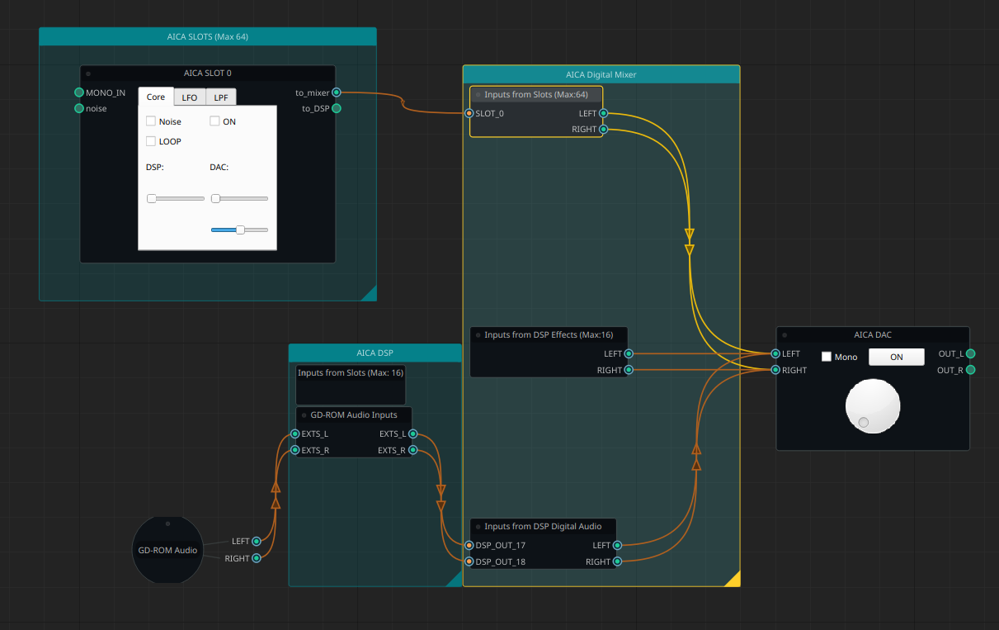

# Yamaha AICA Live User Interface (AICA-LUI)
## What is this ?
* a user-interface on pc that allows you to configure - live - the different parameters of the Yamaha AICA, the sound cpu of the Sega Dreamcast.
* a graphical logical representation of the AICA, allowing a better understanding of the chip.
* a playground/test-program to communicate with the Dreamcast via a named pipe (file).

Hence - use at your own risk / no warranties given.



## Prerequisites:
* [a working KallistiOs installation](https://dreamcast.wiki/Startdev), ideally with [PR 549 merged](https://github.com/KallistiOS/KallistiOS/pull/549) for better speed (ie, >= 11 May 2024)
* Python (3) installed, including the possibility to make Python virtual environments (venv)
* an Operating System/Environment that can work with named pipes.
  * This program was only tested under Linux (Ubuntu 22.04)

## Compile the program that runs on the Dreamcast:
* cd src_dc
* source /opt/toolchains/dc/kos/environ.sh
* make
* cd ..

## Prepare the program that runs on the PC:
* create a Python virtual environment, and install all dependencies:
```
python -m venv ./bin/.venv
./bin/.venv/bin/python -m pip install -U PyQt5
./bin/.venv/bin/python -m pip install -U NodeGraphQt
./bin/.venv/bin/python -m pip install -U setuptools
./bin/.venv/bin/python -m pip install -U soundfile
```

## Launch the UI on the PC:
!! DO NOT LAUNCH THIS FROM Visual Studio Code or any other app !! 
* Launch this from a real terminal, otherwise it will hang when opening an audio file ([known problem with Qt5](https://forum.qt.io/topic/49209/qfiledialog-getopenfilename-hangs-in-windows-when-using-the-native-dialog/13))
```
source ./bin/.venv/bin/activate
python ./src_pc/aica.py
```
* DO NOT INTERACT with the UI yet, but launch the program on the Dreamcast first !
  * interacting with the UI means sending commands to the Dreamcast, so it needs to be running there first.

* Once you finish playing with AICA UI, to quit the virtual environment:
```
deactivate
```

## Launch the program on the Dreamcast:
* If upload via [serial port](https://dreamcast.wiki/Coder%27s_cable), eg:
  * /opt/toolchains/dc/bin/dc-tool-ser -t /dev/ttyUSB0 -b 520833 -x ./bin/AICA_UI.elf
* If upload via [BBA/LAN](https://dreamcast.wiki/Dcload-ip), eg:
  * /opt/toolchains/dc/bin/dc-tool-ip  -t 192.168.1.210 -x ./bin/AICA_UI.elf
* Once this is running on the Dreamcast, you can interact with the UI on the PC.

## Edit the node graph in the UI on the PC:

* Edit the graph in the UI to play music, change the volume, ...:
  1) "AICA slot": 
    * select "noise", or 
    * right-click & select "Add audio source..." and upload a wav/pcm file. Then link the "RAW" output node of that Audio source to the "RAW" input of the "AICA slot"
    * Set the DAC volume of the "AICA slot"
    * Enable the "AICA slot" (check the checkbox)
  4) AICA DAC: 
    * Set the Master Volume
    * Enable the DAC (check the checbox)

## Navigation controls in the UI on the PC:
* alt + mouse-click + drag = move the view
* mouse-scroll = zoom-in/out
* mouse-right-click: display menu

## DISCLAIMER
* This has been programmed with the "no procrastination"-approach, ie just writing code & not think too much if it's the best way of doing things,
* and this is my first serious program in Python, so you'll definitely see horrible things if you look at the code.
  * If you do so, please consider submitting a Pull Request
